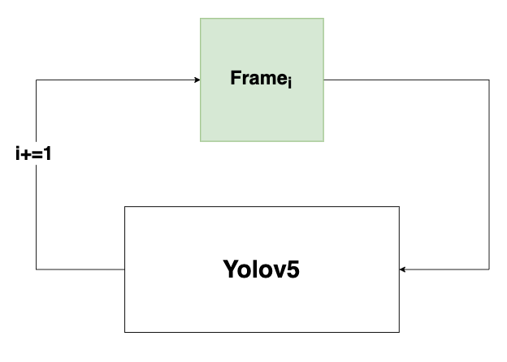
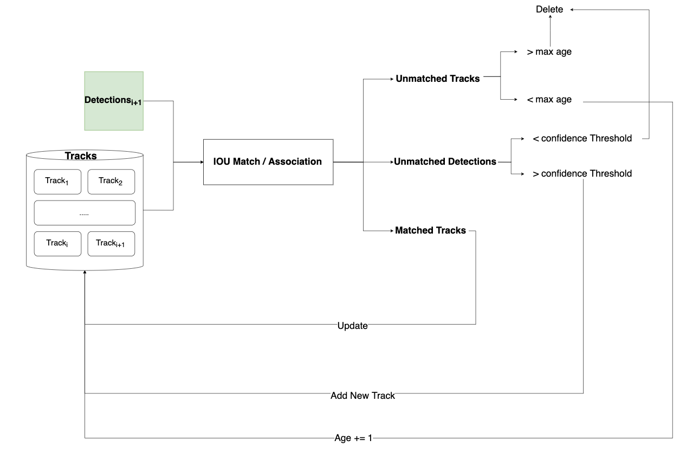
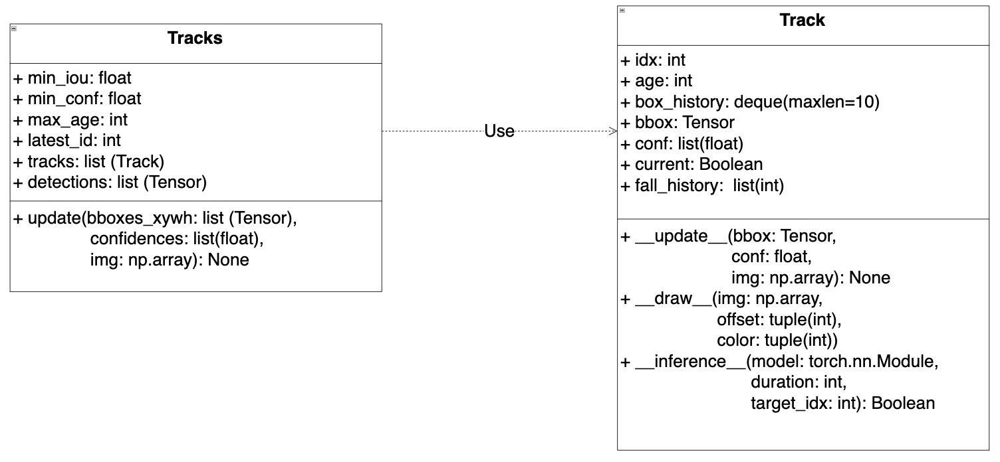
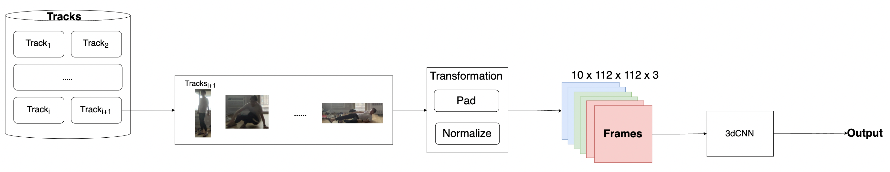

# Fall Detection
<p> In real world, people, especially elder people, are urgent to search for device that can inspect their personal health, given the fact that those people are extremely vulnerable.
Nowadays, people are easily to obtain their physical characteristics by smart device like iWatch.
However, those devices are generally unable to detect some motion characteristics like Falling. Falling is extremely dangerous when someone live alone. So this brought me the inspiration to construct this framework to detect Fall action in home.
</p>


## <div align="center">Pipeline</div>
### Step 1. Detections
The first step is to implement the detection on each frame, so at the end of this stage we can generate detection for each frame in video stream.


#### Step 2. Tracking
Reference on [DeepSort algorithm](https://github.com/nwojke/deep_sort) I decide to adopt the framework of yolov5 + deepsort to accomplish multi-object tracking.
However, the fact is that Jetson Nano 2GB doesn't have enough computing resources to support yolov5+DeepSort inferring in real time. Moreover, considering in our scenario, there will be only limited people appear in the detecting area, so it is not necessary to adopt a complicated tracking system
So here I simplify the framework of Deepsort, Here we didn't use deep network to predict the bounding box in frame t+1 and match the Tracks t+1 with detections t+1. On the contrary, I use the detection in t to match with the detection in t+1. Therefore, kalman filter module is not necessary in current tracking framework.

detail of this pipeline can be seen in the following figure



While building this tracking framework, two most important class: **Tracks** and **Track** are vital to the implementation. The UML with respect to those two class are shown in the following figure


#### Step 3. Fall Detection
The final step is to detect fall action. This part is accomplished by 3DCNN, benefit from the characteristics of spatiotemporal, the model is capable of identifying actions in a period of time. 

For each track in the track pool, we take the crop from it and transform it into form where it is able to be fed into 3dCNN model. 
And finally we have our output for current track.


## <div align="center">Quick Start</div>

<details open>
<summary>Install</summary>

Clone repo and install [requirements.txt](https://github.com/Morris135212/Fall_Detection/blob/main/requirements.txt) in a
[**Python>=3.7.0**](https://www.python.org/) environment, including
[**PyTorch>=1.7**](https://pytorch.org/get-started/locally/).

```bash
git clone https://github.com/Morris135212/Fall_Detection.git  # clone
cd fall_detection
pip install -r requirements.txt  # install
```
</details>

<details open>
<summary>Training</summary>

**yolo training**

Same process as referred to [yolov5](https://github.com/Morris135212/yolov5)

Here we apply pedestrian dataset found online as training set.
```
python train.py --data custom.yaml --cfg yolov5n.yaml --weights '' --batch-size 128
                                         yolov5s                                 64
                                         yolov5m                                 40
                                         yolov5l                                 24
                                         yolov5x                          
```

**3dcnn training**

under the dataset there should be two folders: Train and Test, and it should be like the following

```
- Train
    - Category 1
        - folder_name_1
            - **1.png
            - **2.png
            - **3.png
            - ...
        - folder_name_2
        - ...
    - Category 2
    - ...
Test
    - ..
```
In this framework the layout of the folders is like this:

```
- Train
    - Walk
        - 1
            - 1.png
            - 2.png
            - ...
        - 2
        - ...
    - Fall
Test
    - ..
```
The script below shows how to train a 3dcnn model.
```python
from dataset.cnn3d import CustomDataset
# Load train & validation data
train_path = "./data/dataset/Fall_Detection/Train"
val_path = "./data/dataset/Fall_Detection/Test"
classes = ["Walk", "Fall"]
trainset = CustomDataset(train_path, classes)
valset = CustomDataset(val_path, classes)

# Get model
from models.cnn3d import get_model, resnet10
model = get_model(sample_size=112, sample_duration=10, num_classes=2)
# resnet = resnet10(sample_size=112, sample_duration=10, num_classes=2)

# Training
from train.cnn3d import Trainer

# Configs
config = {
    "model": model,
    "train_data":trainset,
    "val_data":valset,
    "batch_size":2,
    "epochs":20,
    "step_size":200,
    "lr":1e-3,
    "interval":40
}
trainer = Trainer(**config)
trainer()
```

</details>

<details open>
<summary>Fall Detection Inference</summary>

The script below shows how to do Fall detection inference

```python
from models.common import DetectMultiBackend
import torch
from detect.fall_detection.detect import live_inference
from models.cnn3d import get_model

data = "./data/custom.yaml"
weights = "./runs/train/yolov5n/weights/best.pt"
device = torch.device("cuda") if torch.cuda.is_available() else torch.device("cpu")
# Load Yolo model
yolo_model = DetectMultiBackend(weights, device=device, data=data)
# Load 3dCNN model
cnn3d = get_model(sample_size=112, sample_duration=10, num_classes=2)
cnn3d.load_state_dict(torch.load("./runs/cnn3d/basemodel/best.pt", map_location=device))

source = 0 # Live inference
# source = "./runs/detect/exp/Fall_Demo.mp4" # Video

live_inference(yolo_model=yolo_model,
               cnn3d=cnn3d, 
               source=source,
               class_names=["WALK", "FALL"],
               out_name="FALL_DETECTION", #Out put file name
               fall=True, # Whether to perform Fall detection
               conf_thres=0.4)
```
</details>
